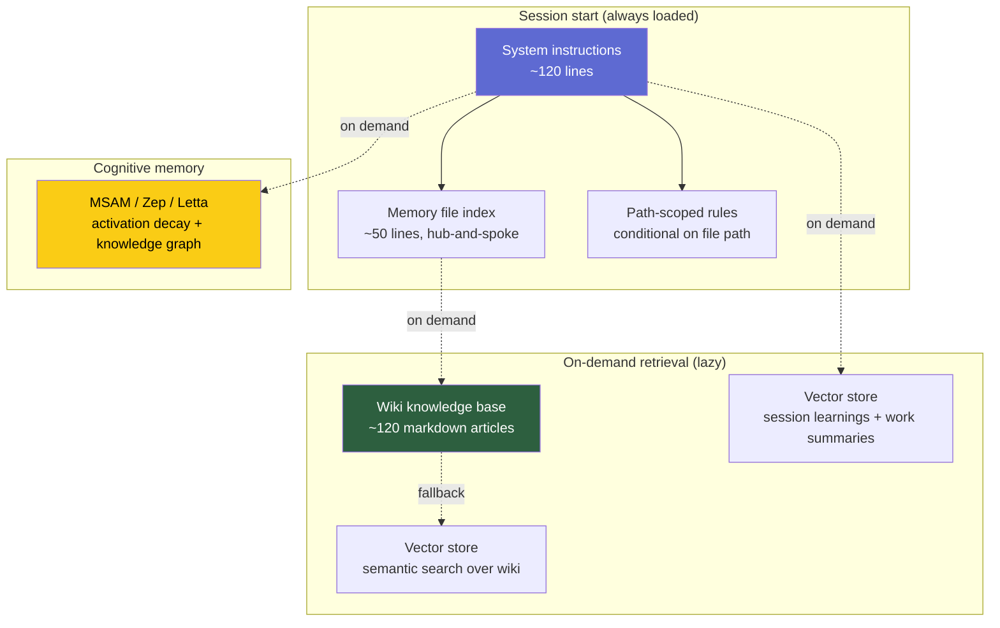

# Agent Memory Architecture

A 6-layer memory system for AI coding agents, running in production daily across a 7-node Kubernetes homelab. Reference implementation uses Claude Code, but the architecture is model-agnostic and maps cleanly to Cursor, Aider, Continue, GitHub Copilot, Cline, or any custom agent built on the Anthropic / OpenAI / Gemini APIs.

[](https://github.com/futhgar/agent-memory-architecture/stargazers)

---

## How this came together

I started where most people start: a single `CLAUDE.md` at the root of every repo. It worked for a few weeks. Then it started failing in the same boring way every time — the file grew past 200 lines, instructions started getting ignored, the agent re-learned the same infrastructure facts every session, and I'd find myself pasting the same context into the chat again.

I added a wiki. The wiki worked, but the agent didn't always find the right article. So I added semantic search over the wiki. That worked, until I noticed I was also accumulating session-specific learnings ("we tried X, it failed because Y") that didn't belong in compiled wiki articles. So I added a separate vector collection for those. Then I noticed those learnings stayed forever — useful ones and stale ones treated identically — so I added cognitive memory with activation decay.

Six layers later, the agent stopped relearning. Sessions that used to start with 20 minutes of context-loading start with the right context already loaded. The token cost is *lower*, not higher, because each layer is targeted: the cheap layers handle the common case, the expensive layers only fire when the cheap ones miss.

This repo is what that ended up looking like — sanitized, templated, and documented enough that you can take any layer (or all six) and apply it to your own setup.

---

## The Six Layers

| Layer | Loads when | Cost | What it solves |
|-------|-----------|------|---------------|
| 1. Auto-memory (tool-provided persistence) | Session start | Always | "Remember what I taught you last session" |
| 2. System instructions (`CLAUDE.md` / `.cursorrules`) | Session start | Always | "How should you behave here?" |
| 3. Path-scoped rules (conditional loading) | When editing matching files | Conditional | "Don't flood context with K8s rules when I'm editing Python" |
| 4. Wiki / knowledge base | On demand | Lazy | "Stop relearning facts every session" |
| 5. Semantic vector search | When the wiki index misses | Lazy | "Find the right article when the keyword search fails" |
| 6. Cognitive memory with activation decay | When temporal dynamics matter | Lazy | "Learn which memories are useful, decay stale ones" |

Most setups stop at Layer 2. Some go to Layer 4 (Karpathy's "LLM Wiki" insight). This repo shows what Layers 5 and 6 look like in practice.

---

## Architecture



Latency profile:

| Layer | Latency | Survives context compaction |
|-------|---------|----------------------------|
| Layers 1-3 | 0 ms (in context) | Yes |
| Layer 4 | ~50 ms (file read) | No (must re-read) |
| Layer 5 | ~20 ms (vector query) | No (must re-query) |
| Layer 6 | ~50 ms (cognitive query) | No (must re-query) |

See [`docs/architecture.md`](docs/architecture.md) for the full breakdown of each layer.

---

## How this maps to your agent

| Layer | Claude Code | Cursor | Aider | GitHub Copilot | Custom agent |
|-------|-------------|--------|-------|---------------|--------------|
| 1. System instructions | `CLAUDE.md` (global + project) | `.cursorrules` | `CONVENTIONS.md` | workspace settings | `system` parameter |
| 2. Path-scoped rules | `.claude/rules/*.md` with YAML `paths:` | `.cursorrules` (single file) | `.aider.conf` + include patterns | custom instructions | prompt composition layer |
| 3. Auto-memory | `~/.claude/projects/<hash>/memory/` | workspace memory | `.aider.chat.history.md` | — | your DB |
| 4. Wiki | markdown + `[[wikilinks]]` (any format) | same | same | same | same |
| 5. Vector search | Qdrant MCP | MCP support (beta) | custom | — | Qdrant / Pinecone / Chroma REST |
| 6. Cognitive memory | MSAM via MCP | MCP support | custom | — | MSAM / Zep / Letta |

The wiki (Layer 4) is completely tool-agnostic — it's just markdown. Layers 5-6 are exposed via MCP servers (Claude Code and Cursor support natively), or via direct REST API calls from any HTTP-capable agent.

See [`docs/adapting-to-other-agents.md`](docs/adapting-to-other-agents.md) for the full integration guide including a 30-line custom-agent example.

---

## Layer 4 in practice: the wiki + interactive graph

Layer 4 is the most underrated piece. A well-curated wiki of compiled knowledge — markdown articles with `[[wikilinks]]` and YAML frontmatter — handles ~95% of what naive RAG does at near-zero operational cost. Most teams jump to vector search too early; a disciplined wiki solves the problem first, and RAG becomes the fallback for when the index doesn't surface the right article.

To make a 100+ article wiki actually navigable, the reference implementation generates an interactive force-directed graph from the `[[wikilinks]]`. Click a node, the article opens in a side panel, and the graph isolates the article and its connections. It's served as a single static HTML file, regenerates from git every 15 minutes via a systemd timer.

The build script ([`scripts/build-wiki-graph.py`](scripts/build-wiki-graph.py)) is included in this repo. You can use it directly or as a starting point — it works with any wiki-style markdown collection.

---

## What's in this repo

```
templates/
  global/CLAUDE.md          Sanitized global system instructions
  project/CLAUDE.md         Sanitized project-level instructions
  rules/
    kubernetes.md           Path-scoped: loads only for kubernetes/**
    terraform.md            Path-scoped: loads only for terraform/**
    dockerfiles.md          Path-scoped: loads only for dockerfiles/**
    wiki.md                 Path-scoped: loads only for wiki/**
  memory-files/
    project_example.md      project-type memory file template
    reference_example.md    reference-type memory file template
    feedback_example.md     feedback-type memory file template
scripts/
  rebuild-memory-index.py   Audit memory files: orphans, stale, oversized, credentials
  build-wiki-graph.py       Generate interactive knowledge graph from [[wikilinks]]
  msam-mcp-wrapper.py       FastMCP wrapper for cognitive memory REST API
  check-sanitization.sh     Pre-publish scanner for secrets / leaked IPs / personal data
  hooks/
    pre-compact-save.sh     Preserve working state before context compaction
docs/
  architecture.md           Deep dive on each of the 6 layers
  adapting-to-other-agents.md   Mapping this to Cursor / Aider / Copilot / custom
  sanitization.md           Pre-publish checklist if you fork this
```

---

## Quick start

One-line installer that auto-detects your agent (Claude Code, Cursor, Aider) and installs templates at the right paths:

```bash
# From your project root — installs Layer 2 (system instructions)
curl -sSL https://raw.githubusercontent.com/futhgar/agent-memory-architecture/main/bootstrap.sh | bash -s -- --layer=2

# Or any other layer (1-6 or 'all'):
curl -sSL https://raw.githubusercontent.com/futhgar/agent-memory-architecture/main/bootstrap.sh | bash -s -- --layer=4

# Dry-run first if you want to see what it'd do:
curl -sSL https://raw.githubusercontent.com/futhgar/agent-memory-architecture/main/bootstrap.sh | bash -s -- --layer=all --dry-run
```

Or use this repo as a **GitHub template**: click the green **"Use this template"** button at the top of the repo to fork it as your own.

For the full decision tree (which layer to install when), see [`docs/getting-started.md`](docs/getting-started.md).

## Standalone scripts

Each script in `scripts/` works on its own — no need to clone the whole repo.

```bash
# Audit your existing memory files (orphans, stale, oversized, credentials)
curl -O https://raw.githubusercontent.com/futhgar/agent-memory-architecture/main/scripts/rebuild-memory-index.py
CLAUDE_MEMORY_DIR=~/.claude/projects/<your-project>/memory python3 rebuild-memory-index.py

# Build an interactive graph from any markdown wiki with [[wikilinks]]
curl -O https://raw.githubusercontent.com/futhgar/agent-memory-architecture/main/scripts/build-wiki-graph.py
WIKI_DIR=./wiki python3 build-wiki-graph.py --output graph.json

# Sanitize a fork before publishing
curl -O https://raw.githubusercontent.com/futhgar/agent-memory-architecture/main/scripts/check-sanitization.sh
bash check-sanitization.sh
```

---

## Sanitization

This repo was built fresh — never a fork of the private origin. Every IP, domain, UUID, and credential has been stripped or replaced with placeholders.

If you fork it, run the bundled checker before publishing your changes:
```bash
./scripts/check-sanitization.sh
```

See [`docs/sanitization.md`](docs/sanitization.md) for the full checklist.

---

## License

MIT.

---

## About

Built by **futhgar** at [Guatu Labs](https://guatulabs.com) — we help companies implement production-grade AI agent infrastructure: memory systems, agent fleets, and the operational tooling to keep them running.

If this architecture solves a problem you're wrestling with and you want help implementing something similar, [get in touch](https://guatulabs.com/contact).
