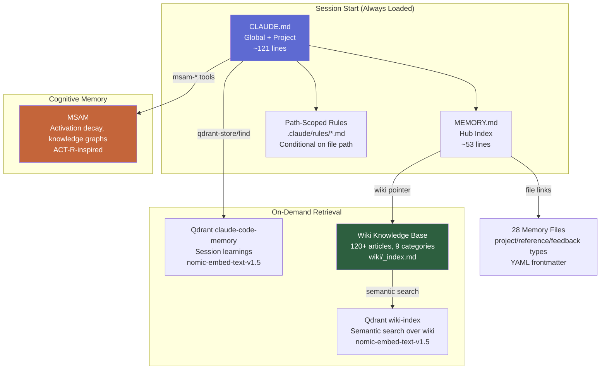

# Memory Architecture — Deep Dive

This document explains each of the 6 memory layers, when they load, what they're good at, and how they compose into a coherent whole.

## The Full Stack



## Layer-by-Layer

### Layer 1: CLAUDE.md (Global + Project)

**What it does:** Static instructions loaded every session. The thing Claude reads first. Defines working style, conventions, critical warnings.

**Size discipline:** Under 200 lines combined. Longer files reduce instruction adherence.

**Hierarchy:**
- `~/.claude/CLAUDE.md` — personal preferences across all projects (~50 lines)
- `<repo>/CLAUDE.md` — project-specific conventions (~70 lines)
- `<repo>/CLAUDE.local.md` — machine-specific, gitignored (not covered here)

**What to include:**
- How to look things up (wiki lookup protocol)
- Working style directives (research-first, documentation policy)
- Security policy
- Critical warnings that could cause data loss
- Quick reference for common paths/IPs/domains

**What NOT to include:**
- Full architecture explanations (belongs in wiki)
- Lists of services (belongs in wiki)
- Tutorial content (belongs in wiki)
- Anything that changes weekly (use path-scoped rules)

### Layer 2: Path-Scoped Rules (`.claude/rules/*.md`)

**What it does:** Markdown files with YAML frontmatter `paths:` that load only when Claude is editing matching files.

**Why:** A monolithic CLAUDE.md wastes context. If you're writing a Python script, you don't need Kubernetes manifest conventions loaded. Path-scoped rules fix this.

**Example:**
```markdown
---
paths:
  - "kubernetes/**"
---

# Kubernetes Conventions
[content only loads when editing files under kubernetes/]
```

**Savings:** Typically 500-800 tokens per session on a real project.

**Common rule domains:**
- `kubernetes.md` → K8s manifest conventions
- `terraform.md` → IaC patterns
- `dockerfiles.md` → Container image standards
- `wiki.md` → Documentation schema
- Application-specific rules for each major service

### Layer 3: Auto-Memory (File-Based)

**What it does:** Claude Code's built-in persistent memory. Markdown files in `~/.claude/projects/<encoded-path>/memory/`. Indexed by `MEMORY.md` (the "hub").

**Compaction survival:** MEMORY.md (first 200 lines / 25KB) survives. The linked files do NOT — they must be re-read.

**Three file types:**
- `project_*.md` — active work (Paperclip projects, shipped products, in-progress initiatives)
- `reference_*.md` — procedures and access methods (how to reach a host, token rotation steps)
- `feedback_*.md` — behavioral directives (what the user wants, what past incidents informed)

**Hygiene rules:**
- Each file under 2KB — larger content belongs in the wiki
- MEMORY.md is a lean index (one line per file) — never inline content
- Run `rebuild-memory-index.py` periodically to detect orphans, stale files, credential leaks
- Delete memory files as they become obsolete — accumulation is a context tax

### Layer 4: Wiki Knowledge Base

**What it does:** Compiled, human-curated knowledge as markdown articles with `[[wikilinks]]`, YAML frontmatter, and a master index.

**Why this is the strongest layer for most users:** A well-curated wiki covers ~95% of what vector RAG does at near-zero operational cost. Most teams jump to RAG too early — a disciplined wiki solves the problem first, and RAG becomes the fallback for when the index doesn't surface the right article.

**Structure:**
```
wiki/
  _index.md           # Master index — read this to find anything
  _schema.md          # Article templates
  _inbox.md           # Staging area for unfinished notes
  infrastructure/     # Cross-cutting infrastructure facts
  services/           # One article per deployed service
  agents/             # Agent fleet configuration
  gotchas/            # Operational issues (symptom/cause/fix)
  runbooks/           # Step-by-step procedures
  decisions/          # Architecture Decision Records
  projects/           # Active and parked projects
  patterns/           # Reusable architectural patterns
  personal/           # User identity, preferences, goals
```

**Article quality > article count.** 50 well-written articles beat 500 dumped transcripts.

### Layer 5: Semantic Vector Search (Qdrant)

**What it does:** When the wiki index doesn't have the right keyword for your query, semantic search finds articles by meaning.

**Stack:**
- Qdrant vector DB
- Embedding model: `nomic-ai/nomic-embed-text-v1.5` via fastembed
- MCP server: `mcp-server-qdrant` 0.8+
- Two collections:
  - `wiki-index` — semantic search over your wiki
  - `<project>-memory` — session learnings and work summaries

**When to use which:**
- Wiki lookup → try `wiki/_index.md` first (fastest)
- If index doesn't help → `qdrant-find` on `wiki-index`
- Store completed session work → `qdrant-store` to memory collection

### Layer 6: Cognitive Memory (MSAM or equivalent)

**What it does:** Memory with activation-based decay, knowledge graphs, contradiction detection. Episodic learnings that fade if not reinforced.

**Why you might need this:** Wiki + Qdrant handles facts well but nothing handles temporal dynamics:
- "Node X had GPU Y from date A to date B"
- "User corrected me twice on the same thing — reinforce"
- "This memory and that memory contradict each other"

**Alternatives:**
- MSAM (custom, ACT-R-inspired)
- Zep / Graphiti (temporal knowledge graph, 20K+ GitHub stars)
- Mem0 (YC-backed hybrid architecture)
- Letta / MemGPT (full agent framework, not just memory)

**Most sophisticated but most expensive layer.** Skip it unless your workload genuinely needs temporal/activation dynamics.

## Latency Profile

| Layer | Latency | Survives compaction? | Token cost |
|-------|---------|---------------------|-----------|
| CLAUDE.md | 0ms (in context) | Yes | ~2,100 tokens |
| MEMORY.md | 0ms (in context) | Yes | ~680 tokens (first 200 lines only) |
| Path-scoped rules | 0ms (conditional) | No (reload on edit) | 0-500 per active rule |
| Wiki article | ~50ms (file read) | No (must re-read) | Variable (1-5K per article) |
| Qdrant query | ~20ms | No (must re-query) | Variable |
| MSAM query | ~50ms | No (must re-query) | Variable |

## Baseline Token Load

Before you type anything, a fresh session loads:
- System prompt: ~4,200 tokens
- Auto-memory MEMORY.md: ~680 tokens (first 200 lines)
- Environment info: ~280 tokens
- MCP tool names: ~120 tokens
- Global CLAUDE.md: ~320 tokens
- Project CLAUDE.md: ~1,800 tokens
- **Total: ~7,850 tokens**

Keep this number down. Every token in the baseline reduces how much the user can actually use for work.

## Context Rot

Anthropic officially acknowledges: more context is not automatically better. Accuracy degrades as token count grows.

**Observed thresholds:**
- Under 25% of context window (256K of 1M): ~92% effectiveness
- Full context: can drop to ~78% effectiveness

**Implication:** Aggressive deduplication matters. Every duplicated instruction pushes you toward rot.
